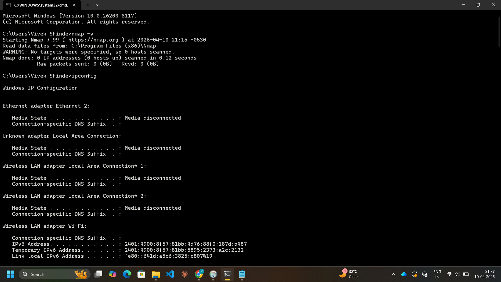
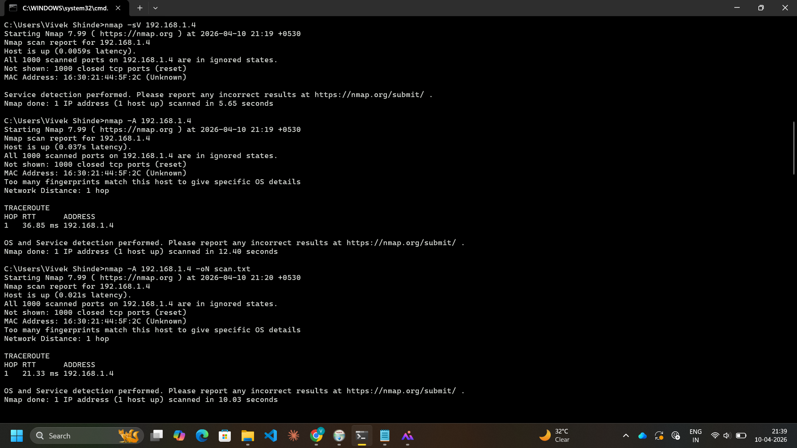

# 🔍 Network Scanning Project using Nmap

## 📌 Objective
The objective of this project is to perform network scanning using Nmap and identify active hosts, open ports, and services running on a network.

---

## 🛠️ Tools Used
- Nmap
- Command Prompt (Windows)

---

## 🌐 Target
- Local Network IP: 192.168.1.4

---

## 🚀 Steps Performed

1. Identified local IP address using `ipconfig`
2. Discovered active hosts using:
   nmap -sn 192.168.1.0/24

3. Performed TCP SYN scan:
   nmap -sS 192.168.1.4

4. Performed service and OS detection:
   nmap -A 192.168.1.4

5. Saved scan results:
   nmap -A 192.168.1.4 -oN scan.txt

---

## 📊 Results

- Host is active and reachable
- No open ports detected
- All scanned ports are closed
- OS detection was inconclusive

---

## 🔐 Analysis

The absence of open ports suggests:
- Strong firewall protection OR
- No active network services running on the target machine

---

## 📸 Screenshot

## 📸 Screenshot

---

## 📁 Files Included

- scan.txt → Contains Nmap scan output
- scan-result.png → Screenshot of scan

---

## 📚 What I Learned

- Basics of network scanning
- How to use Nmap commands
- Understanding open/closed ports
- Importance of network security

---

## 🚀 Future Improvements

- Perform vulnerability scanning using NSE scripts
- Scan multiple hosts
- Use tools like Wireshark for packet analysis

---

## ⚠️ Disclaimer

This project was performed on my own network for educational purposes only.